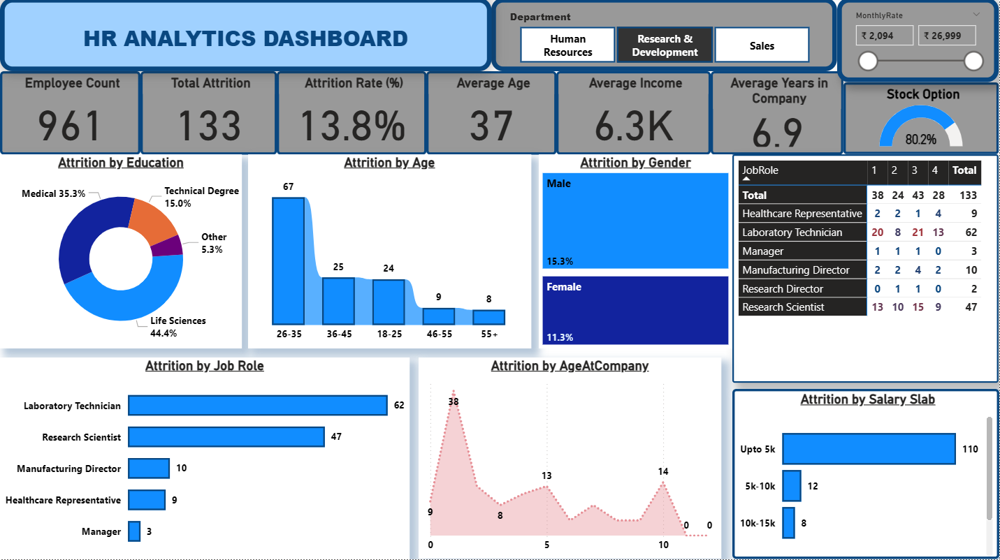

# HR Analytics Dashboard (Power BI)

## 1. Project Overview

This project involves building an interactive HR Analytics Dashboard in Power BI using an employee dataset consisting of 1480 records. The goal of the dashboard is to analyze attrition patterns, employee demographics, and job-related metrics to support data‑driven HR decision‑making.

The workflow includes:
- Data loading and cleaning using Python (Pandas)
- Exporting the cleaned dataset
- Building visualizations in Power BI
- Creating calculated measures using DAX
- Designing an analytical dashboard

## 2. Objectives

The objectives of the HR Analytics Dashboard are:

- Analyze employee attrition trends
- Understand demographics of employees leaving the company
- Track key HR KPIs in a single dashboard
- Identify attrition by age, gender, job role, and salary
- Support HR teams in strategic workforce planning

## 3. Dataset Description

The dataset contains 1480 employees and 38 attributes before cleaning.

Key columns include:

- EmpID
- Age
- AgeGroup
- Attrition (Yes/No)
- Department
- JobRole
- Gender
- MonthlyIncome
- SalarySlab
- YearsAtCompany
- YearsWithCurrManager
- TotalWorkingYears
- OverTime
- BusinessTravel
- TrainingTimesLastYear

Missing values existed only in **YearsWithCurrManager**, and the column was removed during cleaning.

## 4. Data Exploration and Cleaning (Python)

Initial data load and exploration were done in Python using Pandas.

```python
import pandas as pd

df_HR = pd.read_csv('HR_Analytics.csv')
df_HR.head()
df_HR.info()
df_HR.isnull().sum()
```

### Handling Missing Values

One column contained null values:

- YearsWithCurrManager : 57 missing values

The column was removed:

```python
df_HR_cleaned = df_HR.dropna(axis=1)
df_HR_cleaned.to_csv('df_HRanalyticsCleaned.csv', index=False)
```

The cleaned dataset was then used in Power BI.

## 5. Power BI Data Modeling

The cleaned dataset was imported into Power BI.

A calculated measure was created for Attrition Rate:

```DAX
AttritionRate =
SUM(df_HRanalyticsCleaned[AttritionCount]) /
SUM(df_HRanalyticsCleaned[EmployeeCount])
```

Additional measures included:
- Attrition Count
- Average Age
- Average Monthly Income
- YearsatCompany

## 6. Key KPIs Displayed

The dashboard displays the following HR metrics:

- Employee Count
- Total Attrition
- Attrition Rate (%)
- Average Age of attrition employees
- Average Monthly Income of attrition employees
- Average Years at Company
- Stock Option Level

## 7. Visualizations Created

The following visualizations were built in Power BI:

- Donut chart – Attrition by Education
- Stacked column chart – Attrition by Age Group
- Treemap – Attrition by Gender
- Matrix – Attrition by Job Role
- Clustered bar chart – Attrition by Salary Slab
- Area chart – Attrition by Age at Company
- KPI Cards for summary metrics

## 8. Filters / Slicers

Interactive slicers allow dynamic filtering:

- Department (Tile format with multiselect)
- Monthly Rate (Slider)

## 9. Insights Observed



- Higher attrition is seen in young age groups
- Laboratory Technicians show the highest attrition count
- Employees with 1–3 years in company leave more frequently
- Lower salary slab employees exhibit higher attrition
- Both genders contribute to attrition but distribution varies

## 10. Tools Used

- Python (Pandas)
- Power BI Desktop
- CSV/Excel
- Canva (background design)

## 11. Project Workflow Summary

1. Load dataset using Python
2. Explore and understand structure
3. Identify missing values
4. Drop null-containing column
5. Save cleaned dataset
6. Import dataset into Power BI
7. Create DAX measures
8. Create visualizations
9. Combine visuals into dashboard
10. Final formatting and publishing

## 12. Author

Simran Sharma