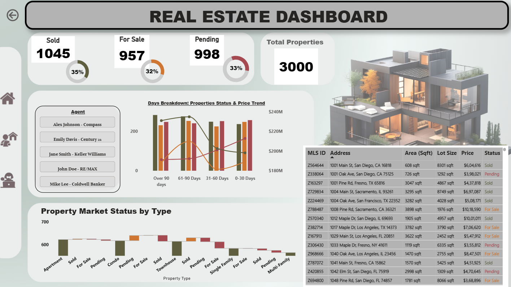

# Real Estate Market Analytics Dashboard (Power BI)

## 1. Project Overview

This project presents an interactive Real Estate Market Dashboard developed in Power BI, based on a dataset containing 3,000 residential property listings across multiple U.S. cities and states.

## The dashboard enables users to:
    - track property status distribution
    - analyze price trends vs days on market
    - explore agent performance
    - compare property types
    - examine individual listing details

Initial data cleaning and validation were performed in Python (Pandas), and the visuals were designed in Power BI using multiple DAX measures. A custom dashboard background was created using Canva.

## 🎯 Objectives

The primary objectives of this project were to:

✔️ explore and clean real estate dataset  
✔️ build interactive Power BI visualizations 
✔️ create dynamic KPI indicators using DAX 
✔️ categorize properties based on days on market 
✔️ analyze price trends vs listing status 
✔️ summarize data through actionable insights

## This dashboard can support:

📌 buyers
📌 sellers
📌 real estate analysts
📌 brokerage firms

## Dataset Description

The dataset consists of 3000 rows and 15 columns.

| Column         | Description                                  |
| -------------- | -------------------------------------------- |
| Price          | Listing price                                |
| Address        | Full street address                          |
| City           | Property city                                |
| Zipcode        | Postal code                                  |
| State          | U.S. state                                   |
| Bedrooms       | Bedrooms count text format                   |
| Bathrooms      | Bathrooms count text format                  |
| Area (Sqft)    | Built-up area                                |
| Lot Size       | Plot area                                    |
| Year Built     | Construction year                            |
| Days on Market | Number of days listed                        |
| Property Type  | House / Apartment / Townhouse / Multi-Family |
| MLS ID         | Listing identifier                           |
| Listing Agent  | Responsible agent                            |
| Status         | Sold / For Sale / Pending                    |

## 🐍 Step 1 — Data Loading & Exploration (Python)

The dataset was first loaded into Pandas.
✔ Printed first 5 rows
✔ Checked datatypes
✔ Verified missing values: All columns contained 0 null values.

## 🛠 Step 2 — Power BI Data Cleaning

Power BI automatically converted fields to data types.

## 🧮 DAX Measures Used

### 1 Property Counts

    Total_Properties = COUNTROWS('RealEstate_Dataset')

    Properties_forSale =
    CALCULATE(
        COUNTROWS('RealEstate_Dataset'),
        'RealEstate_Dataset'[Status] = "For Sale"
    )

    Properties_Pending =
    CALCULATE(
        COUNTROWS('RealEstate_Dataset'),
        'RealEstate_Dataset'[Status] = "Pending"
    )

    Properties_Sold =
    CALCULATE(
        COUNTROWS('RealEstate_Dataset'),
        'RealEstate_Dataset'[Status] = "Sold"
    )

### 2 Percentage Measures

    %_Properties_for_Sale = DIVIDE([Properties_forSale], [Total_Properties], 0)
    %_Properties_Pending = DIVIDE([Properties_Pending], [Total_Properties], 0)
    %_Properties_Sold = DIVIDE([Properties_Sold], [Total_Properties], 0)

### 3 Days on Market Category

    Days_on_Market_Category =
    SWITCH(
        TRUE(),
        'RealEstate_Dataset'[Days on Market] <= 30, "0-30 Days",
        'RealEstate_Dataset'[Days on Market] <= 60, "31-60 Days",
        'RealEstate_Dataset'[Days on Market] <= 90, "61-90 Days",
        "Over 90 Days"
    )

## 📊 Visualizations Created
✅ KPI Cards
- Total properties
- Sold
- Pending
- For Sale
- % distribution KPIs with donut charts

✅ Line & Clustered Column Chart
- **X-axis:** Days on market category
- **Columns:** property counts by status
- **Line:** price trends

✅ Waterfall Chart
- Property type contribution
- Status breakdown impact

✅ Agent Slicer
- Filter across dashboard
- Card-style layout

✅ Detailed Table
*Includes:**
    - price
    - area
    - lot size
    - address
    - agent
    - status

Conditional formatting highlights:
 🟢 Sold
 🟡 Pending
 🟠 For Sale

---

## 🧭 Step-by-Step Project Workflow Summary

1️⃣ Import dataset into Python  
2️⃣ Validate data and their types  
3️⃣ Checked for missing values, if any 
4️⃣ Load data into PowerBI Desktop 
5️⃣ Fix automatic datatype conversions, for some columns like price 
6️⃣ Create calculated columns and DAX measures 
7️⃣ Build KPI cards 
8️⃣ Create days-on-market categories 
9️⃣ Build price trend visual 
🔟 Add interactive slicers 
1️⃣1️⃣ Design Canva dashboard background 
1️⃣2️⃣ Format theme & color consistency 
1️⃣3️⃣ Publish & test filters 
1️⃣4️⃣ Created Github Repository 
1️⃣5️⃣Committed all the changes to github through my Git Supporting Desktop App "SourceTree"

---

## 🛠 Tools Used
- 🐍 Python (Jupyter, VS Code) – preprocessing
- 📊 Power BI – data modeling & visualization
- 🎨 Canva – background design
- 📁 CSV dataset

## Author

Simran Sharma ([Power BI Intern at CodeAlpha)
